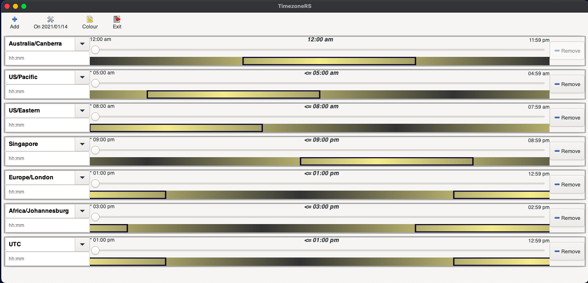

# TimezoneRS

Timezoners makes it a little easier to find times across timezones. It was built as a project to do more work in Rust and explore GUI development with Rust. This is a solved problem and there are plenty of timezone cross reference apps and sites. I wanted to use it to learn and stretch with rust a little more. It is provided as-is and is intended for learning and education purposes. Please see LICENSE.md in the root of the repository.

The application is developed in Rust, employing Gtk (through the [really neat framework relm)]([GitHub - antoyo/relm: Idiomatic, GTK+-based, GUI library, inspired by Elm, written in Rust](https://github.com/antoyo/relm)). The GUI layout was constructed using the [Glade GUI designer](https://glade.gnome.org/). One of the goals of the project was to test out being able to design custom widgets or components in Glade and being able to use them in the UI. The timezone 'control' is structured as a component making it easy to add or remove them from the application at runtime.

Configuration is stored so that things like colour selection and active timeones in the list are persisted between application invocations.

## What it looks like and how it works.

The UI is straightforward and presents a list of selected timezones. Timezones can be added and removed. When first started there are no timezones in the list. 

The screenshot below has a base timezone (always the first one) and 6 additional timezones added. You can also select the date for which you want to compare. This is to cater for daylight saving situations when looking at future dates. All 'base' timezone means is that the times shown on the left and right are the midnight to midnight range and all other timezones are aligned to this one.



The first timezone is the base against which all other timezones are referenced. In the example image above Canberra is the base timezone and the day begins at 12:00am and ends at 11:59pm. The matching time in US/Pacific (the second on the list) is 5:00am for Canberra at 12:00am.

The slider in each time control can be dragged in 15 minute intervals which will update the time of the selected timezone slider as well as all the other timezones, keeping them in sync with each other. The position of the slider determines what time is shown in the label at the center of a time control. This is the time being compared for lack of a better concept.

In the screenshot if you look at the US/Pacific line, the time label in the centre of the timezone control shows "<= 5:00am". The "<=" means the time shown is on the previous day to the base or reference timezone. Therefore at 12:00am in Canberra for the date of 14 January 2021, it is  5:00am in the US/Pacific timezone on the 13th January 2021. The '\*' shown as '\* 5:00 am' also denotes this is on the previous day.

You can enter a time in the entry widget below the timezone name. This will update the slider positions and values for all other timezones. It will round input to the nearest 15 minute matching time.

The shading of the time bar illustrates daylight with midday being the brightest and midnight being the darkest. This is to make it a little easier to conceptually understand the passage and comparison of time in each zone. The colours of the shading can be selected from the "Colour" toolbar button.

The application shows 'work hours' in each timezone using the box around the midday point. It starts at 8:00am and finishes at 5:00pm for each time control. The colour of this box can also be configued using the "Colour" toolbar button.

## Building

Building and running the app should be straightforward assuming cargo and rust are installed.

```bash
git clone
cd timezone-rs
cargo run
```

The cargo.toml config also contains a definition for bulding a bundle for macOS. For this to work cargo-bundle needs to be installed. See [this Github repo](https://github.com/burtonageo/cargo-bundle#:~:text=To%20install%20cargo%20bundle%20%2C%20run,metadata.) for more details.

```bash
cargo install cargo-bundle
cargo bundle
```

## Development notes

The application was developed on a Mac and has been tested on Ubuntu. It should work on Windows although has not been tested.

I tend to use rust nightly as nothing is meant for production use. The app does succesfully compile and run using stable as well. Various versions of rust were used as they were made available but nothing changed in the app between rust versions, it just simply worked.

The relm project makes developing in rust with Gtk a pleasant experience. There are some things that may appear initially confusing in the application:

* There are two .glade definition files. One is for the main window layout and the other for the child timezone component. Maybe this could be done in a single file but I did not find a way to do it. 

* I did not use the view! macro and rather just used the view() function on the the Widget trait. This was so that the GUI could be designed in glade and then included in the app.

* Something I struggled to get my head around initially was how to create sub-widgets or components with relm and have them initialised from the parent window with parameters. The 'trick' was to use the type ModelParam in the child timezone component and define this so that parameters could be passed into the child component on creation. 

* Each timezone control needs to communicate back to the parent window so it can broadcast messages to other timezone widgets. There are what appear to be empty message handlers in the timezone widget implementation. These messages are handled in the parent main Window implementation (connect! macros) that then generate a message handled by the main Window. This could probably also have been done using a channel but I wanted to explore doing it with messages and it works well. Easier (in my opinion) by having a strongly typed enum with parameters that makes sure I don't do anything silly than having to work with communication messages. It is also possible to have a catch-all message handler and simply ignore these messages but I am easily confused so waned to keep them explicitly visible. 

* The parent window can also send update messages to child widgets. This is done using 'emit' on the child widget.
